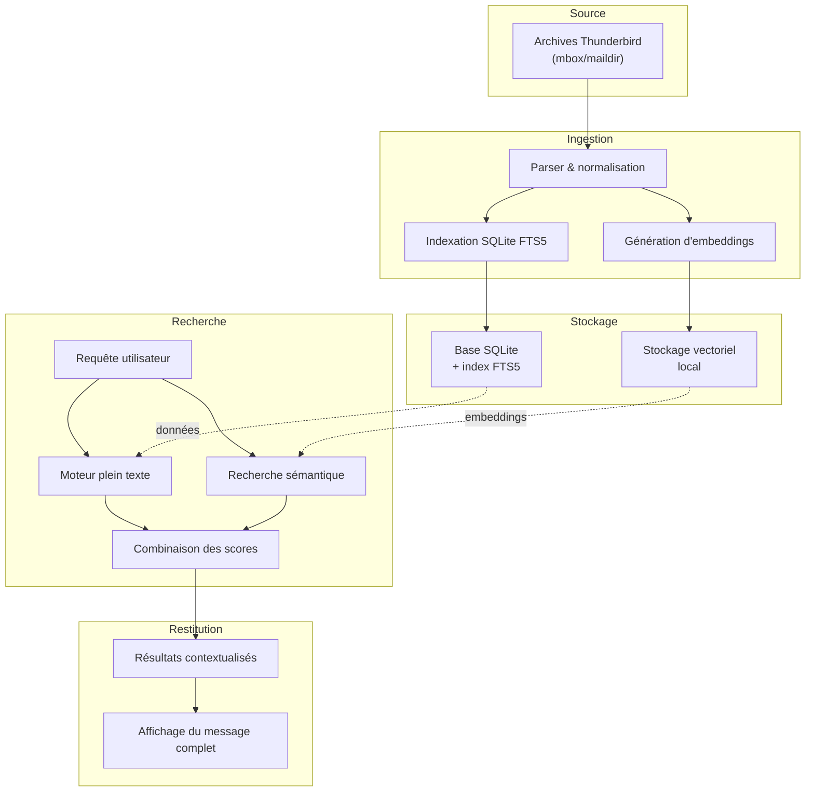

# Mail Search

Outil de recherche rapide dans des archives locales de messages Thunderbird. Le projet vise à fournir une interface capable de retrouver des courriels à partir de requêtes par mots-clés classiques ou d'une recherche sémantique plus avancée, tout en conservant le maximum de traitements en local.

## Objectifs
- **Réactivité** : offrir un temps de réponse minimal pour la recherche dans de grands volumes de messages archivés.
- **Respect de la confidentialité** : limiter les échanges vers l'extérieur et garder les données sur la machine locale.
- **Recherche hybride** : combiner des recherches lexicales traditionnelles et des techniques d'analyse sémantique.

## Contraintes
- Le fonctionnement doit rester majoritairement **hors ligne**.
- Les appels à des services LLM externes doivent être **réduits au strict nécessaire**.
- Compatible avec des archives **Thunderbird** stockées localement.

## Fonctionnalités actuelles

Le dépôt contient désormais un premier prototype 100% local permettant :

- **Indexation** d'un fichier `mbox` Thunderbird vers une base SQLite embarquée avec un index FTS5.
- **Génération d'embeddings locaux** (hashing déterministe par défaut, modèles `sentence-transformers` optionnels) pour une recherche sémantique.
- **Recherche plein texte** via un moteur simple qui retourne des extraits contextualisés.
- **Consultation** du contenu complet d'un message précédemment indexé.

## Utilisation rapide

### Pré-requis

Le projet n'a pas de dépendances obligatoires au-delà de Python 3.11+. Pour activer des modèles d'embeddings plus riches, installez en option `sentence-transformers` et placez le modèle choisi sur la machine (mode offline supporté).

### Indexer un fichier mbox

```bash
python -m mail_search index --db path/vers/index.db path/vers/archive.mbox
```

Options utiles :

- `--no-embeddings` : désactive la génération d'embeddings (index lexical seul).
- `--embedding-backend hash:512` : force un backend spécifique (`hash:<dimension>` ou nom de modèle `sentence-transformers`).

### Lancer une recherche

```bash
python -m mail_search search --db path/vers/index.db "search"
```

Options :

- `--mode semantic` : interroge uniquement l'index vectoriel (similitude cosinus).
- `--mode hybrid` : combine les scores lexicaux (BM25) et vectoriels.
- `--embedding-backend` : choisit le backend à utiliser lors de la requête sémantique.

### Afficher un message

```bash
python -m mail_search show --db path/vers/index.db "<message-id>"
```

## Pistes techniques
1. **Indexation locale**
   - Le prototype actuel repose sur SQLite + FTS5 via le module `mail_search.database`. Les métadonnées et le corps des messages sont stockés dans des tables classiques et l'index plein texte est maintenu automatiquement lors de l'ingestion.
   - L'ingestion (`mail_search.indexer.MailIndexer`) lit aujourd'hui les archives Thunderbird au format `mbox`. Le support de `maildir` reste une piste d'évolution prioritaire.
2. **Recherche sémantique**
   - Les embeddings sont générés localement : par défaut le projet tente de charger `sentence-transformers/all-MiniLM-L6-v2`, puis rétrograde vers un backend de hachage déterministe (`mail_search.semantic.HashEmbeddingBackend`).
   - Les vecteurs sont conservés dans la table `message_vectors` de SQLite et la similarité cosinus est calculée en Python (`mail_search.database.MailDatabase.semantic_search`). Une migration vers un moteur vectoriel spécialisé (ex. `faiss`, `qdrant`) pourra être étudiée si les jeux de données deviennent volumineux.
   - Aucun appel LLM externe n'est effectué tant qu'un backend local est disponible, ce qui garantit un fonctionnement hors ligne.
3. **Interface utilisateur**
   - L'interface CLI (`mail_search.cli`) couvre les besoins de base : indexation (`index`), recherche (`search` en modes lexical, sémantique ou hybride) et affichage (`show`).
   - Une interface web légère (ex. `FastAPI` + `Svelte` ou `React`) pourra compléter la CLI si une interaction plus riche devient nécessaire.

## Plan de travail suggéré
1. **Analyse des archives** : identifier la structure des dossiers Thunderbird à traiter.
2. **Ingestion & indexation** : parser les messages et alimenter l'index lexical + vectoriel.
3. **Moteur de recherche** : implémenter les requêtes combinant mots-clés et similarité sémantique.
4. **Interface** : fournir un MVP CLI permettant de lancer des requêtes et d'afficher les résultats.
5. **Optimisation** : surveiller la latence, la consommation mémoire et la précision des résultats.

## Diagramme d'architecture



## Ressources complémentaires
- [Thunderbird: Exporting emails](https://support.mozilla.org/fr/kb/exporter-sauvegarder-messages) pour obtenir les fichiers d'archives.
- [Sentence Transformers](https://www.sbert.net/) pour les modèles d'embeddings.
- [FAISS](https://github.com/facebookresearch/faiss) ou [Qdrant](https://qdrant.tech/) pour la recherche vectorielle.

## Licence
À définir selon les besoins du projet.
